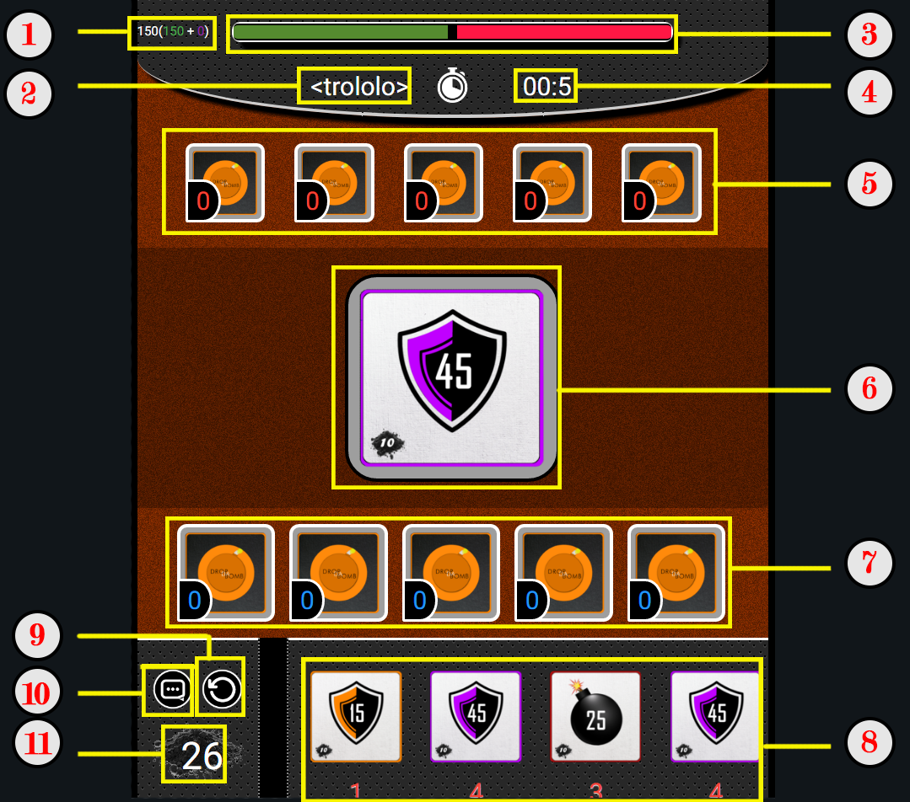

<h1 align="center"> DROP DA BOMB </h1>

## L'interface du jeu

    

**1.** La valeur actuelle de la barre. 150 au départ, puisqu'elle est placée au milieu.
    En violet (ici 0) est representée la valeur actuelle du bouclier qui protege le joueur des attaques directe. 

2. Le nom du joueur qui joue le tour en cours.

3. La barre de vie representée sous forme graphique.

4. Le temps restant pour le tour en cours.

5. La zone de jeu de l'adversaire. Les cinqs emplacements pour les cartes non directes (voir [Les regles](https://github.com/LucasL13/WORK-L3/blob/master/DDB/Documentation/LesRegles.md)). Le logo de carte verso par défaut (ici sur les 5 emplacements) signale un emplacement vide.

6. Le tas de carte de la partie. La carte representée est celle du dessus, c'est à dire la dernière posée.

7. Ma zone de jeu. Ici, encore une fois, les cinq emplacements sont vides. Le petit compteur en bas-gauche de chaque carte represente le nombre de tour restant avant l'activation et/ou la fin de cette carte.

8. Ma main de jeu. Les quatres cartes jouables, issues de mon deck. Cette main est toujours completée une fois le tour fini (on commence le tour avec 4 cartes, systématiquement).

9. Le bouton "Fin de tour" pour passer au tour de l'adversaire.

10. Le bouton "Chat". Fonctionnalité pas encore implémentée.

11. La poudre. Represente le montant de poudre disponible (la ressource utilisée pour jouer les cartes).

    

Ci-dessus, une capture de l'interface qui apparait lorsqu'on pose une carte d'attaque directe. On choisit la cible de cette attaque.  