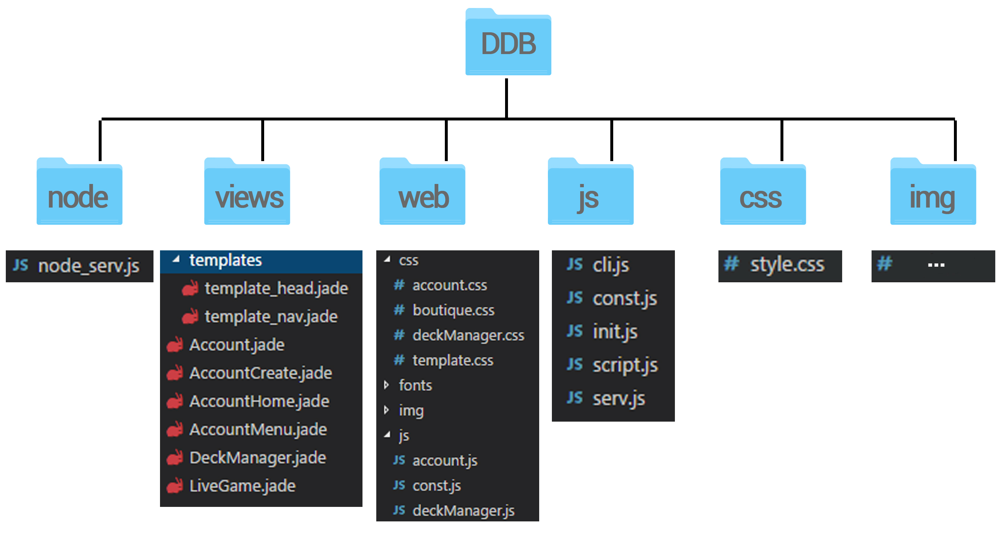

<h1 align="center"> DROP DA BOMB </h1>

## Les aspects techniques

### L'architecture du projet

    

Le projet DropDaBomb est basé sur une architecture Client-Serveur classique. 
Le client est un client web, il est donc ouvert à tous les systèmes d’exploitation, tous les navigateurs, quel que soit le support. 
Le serveur est un serveur distant, adressé par une IP publique, qui repose sur deux technologies : Node.js pour l’aspect purement serveur (détaillé dans les parties suivantes) et MySQL pour le serveur Base de Données. Seul le serveur Node.js est autorisé à échanger avec la base de données, le client communique donc uniquement avec le serveur Node.js.

*Dans un soucis de simplification, on parlera de **Serveur** pour le serveur Node.js et de **Base de données** ou **BDD** pour la partie serveur MySQL*

### La structure du projet 
 

    

#### Dossier "node"

Ce dossier contient le fichier *node_serv.js*. Il s'agit du serveur *principal* ; le serveur web chargé, entre autres, de servir les fichiers au client. Dans le détail, il s'agit d'un programme assez complexe, qui se charge de gérer les cookies, de faire le "rendering" des pages à renvoyer au client, .. Voir la section [Les packages](Packages.md) pour plus d'informations. 

#### Dossier "views"

Ce dossier contient les fichiers *.jade* qui seront utilisés par le moteur de rendering de **Jade** afin de servir le code HTML de chaque page au client. Il possède un sous-dossier *Templates* qui contient les deux fichiers *.jade* utilisés par les autres fichiers "principaux" afin d'ajouter les lignes de code communes à toutes les pages HTML, comme le chargement des scripts ou des feuilles de style. Voir la section [Les packages / Jade](Packages.md#jade) pour plus d'informations.

#### Dossier "web"

Ce dossier contient le "contenu additionnel". Il s'agit des feuilles de styles, des scripts, des polices ou des images que les fichiers *.jade* utilisent. 

Il est possible de fusionner le dossier *views* et le dossier *web* mais nous avons fais le choix de différencier les portions purement techniques et le reste dans notre architecture.

#### Dossier "js"

Ce dossier contient les scripts importants de notre architecture ainsi que le fichier *serv.js* qui est un second serveur node mais dont le role est différent du premier serveur ; celui-ci est le serveur **de jeu**, qui gère notamment le matchmaking et le déroulement d'un match. 

#### Dossier "css"

Ce dossier contient le fichier *style.css* qui recence les règles de style (CSS) principales.

#### Dossier "img"

Ce dossier contient un nombre importants d'images qui sont utilisées par le site et par le jeu (backgrounds, cartes de jeu, icônes, etc..).